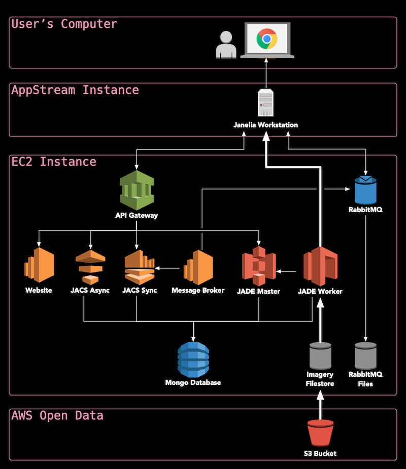

# HortaCloud

HortaCloud is a streaming 3D annotation platform for large microscopy data that runs entirely in the cloud. It is based on the [Janelia Workstation](https://github.com/JaneliaSciComp/workstation) software and was originally developed in support of the [MouseLight Team Project](https://www.janelia.org/project-team/mouselight).

It combines state-of-the-art volumetric visualization, advanced features for 3D neuronal annotation, and real-time multi-user collaboration with a set of enterprise-grade backend microservices for moving and processing large amounts of data rapidly and securely. HortaCloud takes advantage of cloud-based Virtual Desktop Infrastructure (VDI) to perform all 3D rendering in cloud-leased GPUs which are data-adjacent, and only transfer a high-fidelity interactive video stream to each annotator’s local compute platform through a web browser.

More information is available on the [HortaCloud website](https://hortacloud.janelia.org).

## Deployment

[See the documentation](https://hortacloud.janelia.org/docs/administration/aws/) to learn how to deploy this system to your AWS account.

## Contributing

Read about [how to contribute](CONTRIBUTING.md) to this project.
