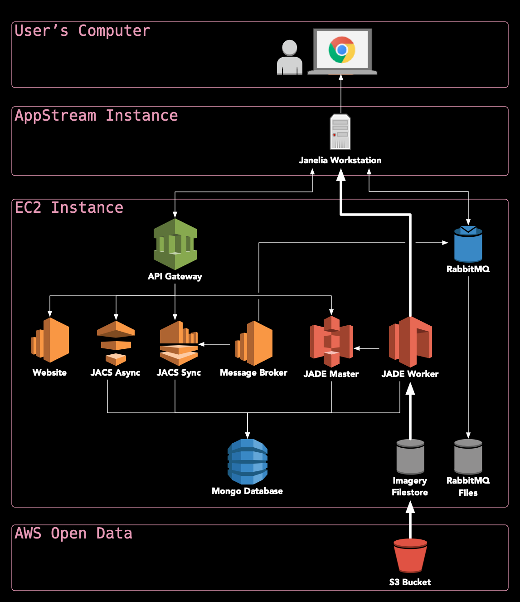
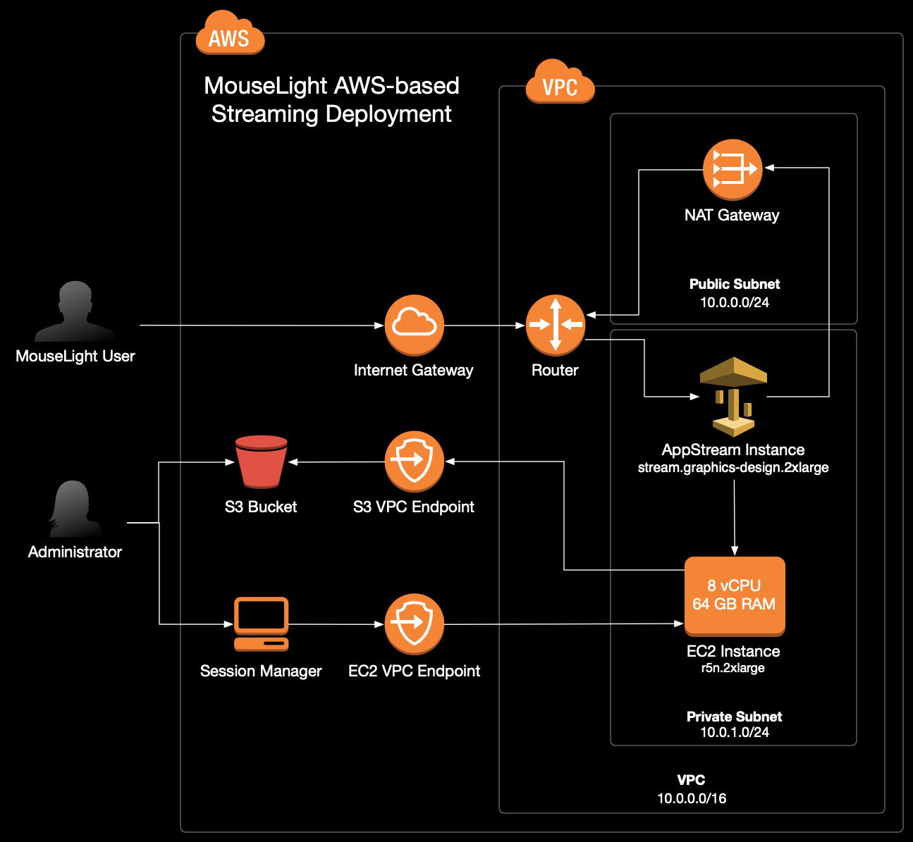

# janeliaHortaCloud

JaneliaHortaCloud is a streaming 3D annotation platform for large microscopy data that runs entirely in the cloud. It is based on the [Janelia Workstation](https://github.com/JaneliaSciComp/workstation) software and was originally developed in support of the [MouseLight Team Project](https://www.janelia.org/project-team/mouselight).

It combines state-of-the-art volumetric visualization, advanced features for 3D neuronal annotation, and real-time multi-user collaboration with a set of enterprise-grade backend microservices for moving and processing large amounts of data rapidly and securely. JaneliaHortaCloud takes advantage of cloud-based Virtual Desktop Infrastructure (VDI) to perform all 3D rendering in cloud-leased GPUs which are data-adjacent, and only transfer a high-fidelity interactive video stream to each annotator’s local compute platform through a web browser.



## Getting Started

To make use of this repo, you should have **node v14** installed on your local machine. We recommend using [nvm](https://github.com/nvm-sh/nvm) to install and activate this version of node. You should also install the [AWS CDK](https://aws.amazon.com/cdk/) and configure it with your AWS account information. Installation instructions can be found on the [AWS website](https://docs.aws.amazon.com/cdk/v2/guide/getting_started.html)

After cloning this repo, run the following command to download dependencies.
 ```
 npm run setup
 ```

## Implementation details

The deployment uses AWS CDK to create AWS resources on your AWS account as shown in the diagram below. All services run in a secured Virtual Private Cloud (VPC).




## Setting up the environment

* Install AWS CLI
  * AWS CDK requires AWS CLI to be installed and configured on the computer from which one runs the deployment procedure. [Installation](https://docs.aws.amazon.com/cli/latest/userguide/cli-chap-getting-started.html) & [configuration](https://docs.aws.amazon.com/cli/latest/userguide/cli-chap-configure.html) instructions can be found in the AWS documentation.

* Install AWS CDK by running
  ```
  npm install
  ```
  This command will install CDK in a development environment so you can access its help as below (notice the '--' separator between cdk and cdk options - this is specific to npm not to cdk so all CDK flags must be after the double hyphen separator):
  ```
  npm run cdk -- --help
  ```

After the CLI and CDK are installed, and before actually deploying the application you need to set up a few environment variables.

You can do that by copying the current template into '.env' file and then editing the '.env' file

```bash
cp env.template .env
```

The following values must be set in the .env file:
```env
AWS_REGION=<your aws region>
AWS_ACCOUNT=<your aws account>

HORTA_ORG=<app qualifier name>
ADMIN_USER_EMAIL=<admin email>

JACS_JWT_KEY=<a 32 byte jwt secret>
JACS_MONGO_KEY=<a 32 byte mongo secret>
JACS_APP_PASSWD=<app password>
RABBITMQ_PASSWD=<rabbitmq password>
JACS_API_KEY=<jacs api key>
JADE_API_KEY=<jade api key>
HORTA_DATA_BUCKETS=<s3 buckets that hold MouseLight data>
```

For the api keys or for secrets you can generate them using:
```
openssl rand -hex 32
```
We prefer this procedure because these values will be handled during the installation using the `sed` command and it is preferable that they not contain any characters that require escaping in a sed command.

If you already have data on some S3 buckets you can add them to `HORTA_DATA_BUCKETS` as a comma separated list. For example, if you want to use Janelia's Open Data bucket but in addition you also have your data on a private bucket ('janelia-mouseligh-demo' in this example) you need to set `HORTA_DATA_BUCKETS="janelia-mouselight-imagery,janelia-mouselight-demo"`. Currently it is set to Janelia's open data MouseLight bucket only. Every bucket specified in the 'HORTA_DATA_BUCKETS' list will be available in the workstation as `/<s3BucketName>` directory.

If you want to change the setting for `HORTA_WS_INSTANCE_TYPE`, keep in mind that you may have to change `HORTA_WS_IMAGE_NAME`
For `HORTA_WS_INSTANCE_TYPE` set to any `stream.graphics.g4dn.*` instances:
* `stream.graphics.g4dn.xlarge`
* `stream.graphics.g4dn.2xlarge`
* `stream.graphics.g4dn.4xlarge`
* `stream.graphics.g4dn.8xlarge`
* `stream.graphics.g4dn.12xlarge`
* `stream.graphics.g4dn.16xlarge`

use: `HORTA_WS_IMAGE_NAME=AppStream-Graphics-G4dn-WinServer2019-07-19-2021` image.

For `HORTA_WS_INSTANCE_TYPE` set to any `stream.graphics-pro.*` instances:
* `stream.graphics-pro.4xlarge`
* `stream.graphics-pro.8xlarge`
* `stream.graphics-pro.16xlarge`

use `HORTA_WS_IMAGE_NAME=AppStream-Graphics-Pro-WinServer2019-10-08-2021` image


#### IAM Required Roles

In order to create an AppStream Image Builder, which is needed to create the Workstation Image, you need to have all [roles required by AppStream](https://docs.aws.amazon.com/appstream2/latest/developerguide/roles-required-for-appstream.html). Check that by simply connecting to the AWS console and check if the Roles are available in the IAM Service - select "Services" > "Security, Identity, Compliance" > "IAM" then verify that the required roles are present:
* AmazonAppStreamServiceAccess
* ApplicationAutoScalingForAmazonAppStreamAccess
* AWSServiceRoleForApplicationAutoScaling_AppStreamFleet

#### AWS Limits.

Most AWS services allow you to setup restrictions on the number of active instances. The default limits, especially for some AppStream resources, such as "Maximum ImageBuilders" for some graphics instances - "stream.graphics.g4dn.xlarge" may be really low (0 in some cases). Connect to AWS console "Service Quotas" service and increase the limit for in case you see a `limit was exceeded` error. Typically take a look at the limits setup for your account for EC2, VPC, AppStream, S3. Keep in mind that limits may be different from instance type to instance type for AppStream service, so you may have to adjust the limits based on the AppStream instance type selection.

## Deployment
After the setup is complete, deploy the application by running:

```bash
npm run deploy
```

There are a few steps during the deployment that require manual intervention. The deploy script will indicate when these steps should be taken with a ⚠️  warning message.

The full deployment of the application is done in 3 steps run automatically one after the other, but the second step requires manual intervention:

1) **Deploy the back-end stacks** - this includes the AppStream builder. At the back end deployment the installation process will also create the admin user configured in `ADMIN_USER_EMAIL`.

2) **Connect to AppStream builder and install the workstation application** - This is a semiautomated step that involves copying and running two PowerShell scripts onto the AppStream builder instance.

3) **Deploy the user login and administration stack.**


### Client app installation

For client installation start and connect to the AppStream builder instance then copy the following scripts from this repo to the AppStream instance:
- [installcmd.ps1](vpc_stack/src/asbuilder/installcmd.ps1) - installs JDK and the workstation
- [createappimage.ps1](vpc_stack/src/asbuilder/createappimage.ps1) - creates the AppStream image

After you copied or created the scripts:
* Log in to the AWS console and go to https://console.aws.amazon.com/appstream2
* Find your new builder in the "Images > Image Builder" tab
* Click on the image name and open an "Administrator" window by clicking on the "Connect" button.
* Copy the installation scripts from your local machine to AppStream:
    * Click on the folder icon at the top left of the window
    * Select the `Temporary Files` folder
    * Use the `Upload Files` icon to find the files on your machine and upload them.
* Open the powershell by typing "`Power shell" in the search found at the bottom left of the window. This step used to require an "Administrator Power Shell" but now it needs only a regular user power shell and it may actually fail the install if you run it in an Administrator Power Shell.
* Change to the directory where you uploaded the installation scripts, eg:
```
  cd 'C:\Users\ImagebuilderAdmin\My Files\Temporary Files'
```
* Run the installcmd script to install the workstation. &lt;serverName&gt; is the name of the backend EC2 instance, typically it looks like ` ip-<ip4 with dashes instead of dots>.ec2.internal`.

  ```
  installcmd.ps1 <serverName>
  ``` 
  This will install the JDK and the workstation. The installer will run silently and it will install the workstation under the `C:\apps` folder. If it prompts you for the install directory, select `C:\apps` as the JaneliaWorkstation location.

  * To start the workstation for testing, run:
    ```shell
    c:\apps\runJaneliaWorkstation.ps1
    ``` 
    * when prompted, login as the admin user you set in ADMIN_USER_EMAIL (leave the password empty)
    * Navigate through the menus to make sure the workstation is working. *Do not create any user accounts at this time as they will get created from the Admin web application.*
    * When testing is finished, close down the workstation.

* Finalize the creation of the AppStream image, run:
  ```
  createappimage.ps1
  ``` 
  Keep in mind that once you start this step the builder instance begins the snapshotting process and it will not be usable until it completes. After this is completed the AppStream image should be available and the builder will be in a stop state. To use it again you need to start it and then you can connect.

* You can now safely close the AppStream session and return to the AppStream console. There you will see a new image in the image registry with a status of `Pending`.

* Once the image status has changed to a status of `Available` you can start the fleet by going to the `Fleets` page on the AppStream site.

  * Select your fleet from the list of fleets and then select 'Start' from the `Action` menu.

* At this point the installtion script you started on your host machine, should continue to completion.

## Import imagery into the Workstation

If you already have the data on the S3 buckets in the Workstation, select **File** → **New** → **Tiled Microscope Sample**, and then set "Sample Name" to `<sampleDirectoryName>` and "Path to Render Folder" as `/<bucketName>/<sampleDirectoryName>`.

Open the Data Explorer (**Window** → **Core** → **Data Explorer**) and navigate to Home, then "3D RawTile Microscope Samples", and your sample name. Right-click the sample and choose "Open in Horta". This will open the Horta Panel and then from the Horta Panel you have options to create a workspace or to open the 2D or the 3D volume viewer.

## Troubleshooting

### Troubleshooting client app installation

If the client app installation fails for any reason, before you attempt the install again you must remove everything that was installed by the install script. Uninstall all applications installed with scoop and remove the 'C:\apps' folder. To do that run:
```
scoop uninstall scoop
del c:\apps
```
When prompted whether you really want to uninstall everything, select "yes" or "all".

## Customizing the portal URL

By default the application will have a very long url that is not easy to remember, something like:
http://janelia-hortacloudwebapp-janeliahortacloudwebadmi-yefcny29t8n6.s3-website-us-east-1.amazonaws.com/. Follow these instructions to create a shorter domain for use with your installation.

* Register a domain with Route53 or your domain provider.
  - The Route53 page in the AWS console has a "Register domain" form.
  - Alternative providers can also be used, but it requires a little more work.

* Purchase an SSL certificate for your domain.
  - This can be done with [AWS Certificate Manager](https://aws.amazon.com/certificate-manager/)
  - or an external certificate provider, often it can be done with the same company that provided your domain registration. Use the "Import a certificte" button to register your certificate with AWS.

* Use the "Create distribution" button on the CloudFront console to attach your registered domain to the s3 bucket that hosts the admin portal.
  - the only things that need to be changed from the defaults are
    - "Origin domain" - this should be the domain that was originally generated for your admin portal.
    eg: *janelia-hortacloudwebapp-janeliahortacloudwebadmi-yefcny29t8n6.s3-website-us-east-1.amazonaws.com*
    - "Viewer protocol policy" - Change this to "Redirect HTTP to HTTPS"
    - "Custom SSL certificate" - Select the certificate that you registered with AWS Certificate Manager
  - Finally, click the "Create distribution" button.
